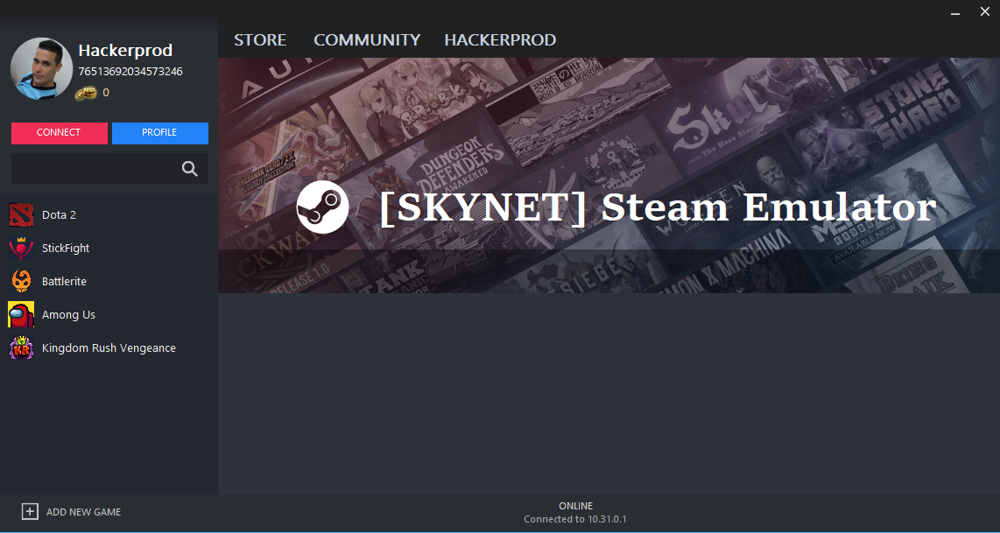

 # [SKYNET] Steam Emulator
This project is created with the aim of replacing the original `steam_api.dll` from Steam with this one and thus emulating a connection to be able to play games in LAN mode.
This is not a steamworks wrapper like `Steamworks.Net` or `Facepunch`.
The project is in an initial stage, so it is not functional yet for some Games.



## 📁 Directory structure
```
📁 Game folder                     
└──📁 SKYNET
   ├──📁 AvatarCache                  // Contains avatars cache
   ├──📁 Storage                      // Contains stats and achievements files
   |  └──📁 Remote                    // Contains game files
   ├──📄 [SKYNET] steam_api.ini       
   └──📑 [SKYNET] steam_api.log       // If option is enabled
```

## 🔗 Features

```
User Stats manager         Save and Load user stats from local folder.
Achievements manager       Save and Load user achievements from local folder.
CSteamworks emulation      Rename the emu to **CSteamworks.dll** to emulate them.
Multiplataform             Works with multiple game engines like Source 2, Unity 3D etc.
Network communication      Network communication between clients through a configurable port.
Overlay                    External Overlay for steam and game messages.
DLC                        Unlock all downloaded DLCs
Avatar support             Load avatar from file (Avatar.jpg) inside SKYNET folder and share it with the other players through the network
Plugin system              Load external plugin to communicate with the emu.
```
## ⚙️ Settings
When the emulator runs for the first time, it create the directories that it is going to use and generates them inside the SKYNET folder the `[SKYNET] steam_api.ini`<br />
<details><summary>Settings structure</summary><br />

 [User Settings]<br />
PersonaName = Hackerprod<br />
AccountId = 1000<br />

[Game Settings]<br />
Languaje = spanish<br />
AppId = 570<br />

[Network Settings]<br />
ServerIP = 127.0.0.1<br />
BroadCastPort = 28025<br />

[Log Settings]<br />
File = false<br />
Console = true<br />

</details>

## 🔨 Currently working on
Callback system implementation.<br />
Fucking SteamInternal_ContextInit in x86 Games

## 📝 Log
When File log option si enabled in settings, a log file will be created in the root of the game executable with the following name `[SKYNET] steam_api.log`

## 🔌 Plugin system
The plugin system is developed in order to establish a communication between the game and the game coordinator, the following example shows a basic plugin. <br /><br />
**Interface for Game coordinator plugin:**
```csharp
namespace SKYNET.Plugin
{
    public interface IGameCoordinatorPlugin
    {
        uint Initialize();
        void MessageFromGame(byte[] bytes);
        EventHandler<Dictionary <uint, byte[]>> IsMessageAvailable { get; set; }
    }
}
```
**Game coordinator plugin example:**
```csharp
namespace SKYNET.Plugin
{
    public class Dota2GameCoordinator : IGameCoordinatorPlugin
    {
        private uint AppID = 570;
        public EventHandler<Dictionary<uint, byte[]>> IsMessageAvailable { get; set; }

        public uint Initialize()
        {
            // TODO: Initialize all Game coordinator class
            return AppID;
        }

        public void MessageFromGame(byte[] bytes)
        {
            // Process message from game
            uint MsgType = MsgUtil.GetGCMsg(new MemoryStream(bytes).ReadUInt32L());
            IPacketGCMsg packetGCMsg = MsgUtil.GetPacketGcMsg(MsgType, bytes);
            // TODO: Process GC message
        }

        public void SendPacketToGame(uint msgType, byte[] packet)
        {
            Dictionary<uint, byte[]> message = new Dictionary<uint, byte[]>();
            message.Add(msgType, packet);
            IsMessageAvailable?.Invoke(this, message);
        }

        public void SendPacketToGame(Dictionary<uint, byte[]> messages)
        {
            IsMessageAvailable?.Invoke(this, messages);
        }
    }
}
```

## ⭐ Implemented Interfaces

<details><summary>Click to expand</summary><br />

- [x] ISteamAppDisableUpdate
- - [x] SteamAppDisableUpdate001
- [x] ISteamAppList		
- - [x] ISteamAppList001
- [x] ISteamAppDisableUpdate
- - [x] ISteamAppDisableUpdate001
- [x] ISteamApps
- - [x] ISteamApps008
- [x] ISteamClient		
- - [x] ISteamClient017
- - [x] ISteamClient018
- - [x] ISteamClient019
- - [x] ISteamClient020
- [x] ISteamController
- - [x] ISteamController005
- - [x] ISteamController006
- - [x] ISteamController007
- - [x] ISteamController008
- [x] ISteamFriends		
- - [x] ISteamFriends015
- - [x] ISteamFriends017 
- [x] ISteamGameCoordinator
- - [x] ISteamGameCoordinator001
- [ ] ISteamGameSearch		
- [x] ISteamGameServer
- - [x] ISteamGameServer012 
- - [x] ISteamGameServer014
- [x] ISteamGameServerStats	
- - [x] ISteamGameServerStats001 
- [x] ISteamGameStats	
- - [x] ISteamGameStats001 
- [x] ISteamHTMLSurface
- - [x] ISteamHTMLSurface003
- - [x] ISteamHTMLSurface004
- - [x] ISteamHTMLSurface005
- [x] ISteamHTTP
- - [x] ISteamHTTP002 
- - [x] ISteamHTTP003 
- [x] ISteamInput
- - [x] ISteamInput001
- - [x] ISteamInput002
- - [x] ISteamInput006
- [x] ISteamInventory
- - [x] ISteamInventory002
- - [x] ISteamInventory003
- [x] SteamMatchGameSearch
- - [x] SteamMatchGameSearch001 
- [ ] ISteamMasterServerUpdater
- [x] ISteamMatchmaking		
- - [x] ISteamMatchmaking008 
- - [x] ISteamMatchmaking009
- [x] ISteamMatchmakingServers
- - [x] ISteamMatchmakingServers002 
- [x] ISteamMusic		
- - [x] ISteamMusic001 
- [x] ISteamMusicRemote
- - [x] ISteamMusicRemote001 
- [x] ISteamNetworking		
- - [x] ISteamNetworking005
- - [x] ISteamNetworking006 
- [x] ISteamNetworkingMessages
- - [x] SteamNetworkingMessages002
- [x] ISteamNetworkingSockets	
- - [x] ISteamNetworkingSockets008
- - [x] ISteamNetworkingSockets009
- - [x] ISteamNetworkingSockets012
- [x] ISteamNetworkingSocketsSerialized
- - [x] ISteamNetworkingSocketsSerialized002 
- - [x] ISteamNetworkingSocketsSerialized003 
- - [x] ISteamNetworkingSocketsSerialized004 
- - [x] ISteamNetworkingSocketsSerialized005 
- [x] ISteamNetworkingUtils	
- - [x] ISteamNetworkingUtils003
- [x] ISteamParentalSettings
- - [x] ISteamParentalSettings001 
- [x] ISteamRemotePlay		
- - [x] ISteamRemotePlay001		
- [x] ISteamRemoteStorage
- - [x] ISteamRemoteStorage013 
- - [x] ISteamRemoteStorage014 
- - [x] ISteamRemoteStorage016 
- [x] ISteamScreenshots		
- - [x] ISteamScreenshots003 
- [ ] ISteamTV
- [x] ISteamUGC			
- - [x] ISteamUGC010
- - [x] ISteamUGC012
- - [x] ISteamUGC014
- - [x] ISteamUGC015
- - [x] ISteamUGC016
- [x] ISteamUnifiedMessages
- - [x] SteamUnifiedMessages001 
- [x] ISteamUser
- - [x] ISteamUser019 
- - [x] ISteamUser020 
- - [x] ISteamUser021 
- [x] ISteamUserStats		
- - [x] ISteamUserStats012 
- [x] ISteamUtils
- - [x] ISteamUtils009
- - [x] ISteamUtils010
- [x] ISteamVideo			
- - [x] ISteamVideo002 
</details>

