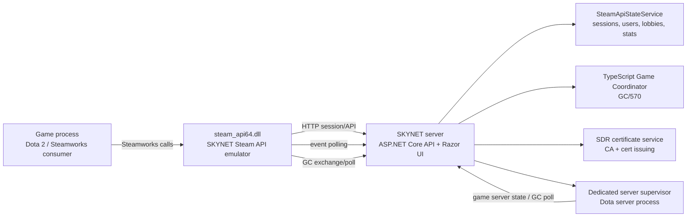

# SKYNET Steam Emulator

> A server-backed Steamworks compatibility layer focused on Steam DLL ABI fidelity, local service emulation, Dota 2 Game Coordinator experimentation, and repeatable runtime diagnostics.

SKYNET Steam Emulator is not a standalone "fake Steam client" in the old LAN-only sense. The current architecture is split into two cooperating components:

- `steam_api/` - a Steam API DLL emulator packaged as launcher payloads. The launcher injects the payload DLL into the game process at startup instead of replacing files in the game folder.
- `SKYNET server/` - an ASP.NET Core backend that owns identity, session state, friends, avatars, lobbies, stats, remote storage, auth validation, game server state, P2P relay queues, SDR certificate issuance, and Game Coordinator routing.

The DLL stays close to the native Steamworks ABI while the backend provides a central authority for state that multiple clients and game servers can share.

## Project Status

This project is an active emulator and compatibility layer. It is designed for controlled development and testing environments, not as a complete replacement for Steam, Valve services, VAC, or the Dota 2 backend.

Important boundaries:

- SteamNetworkingSockets certificates and Steam authentication tickets are different mechanisms.
- A locally accepted networking certificate does not imply Valve VAC trust.
- `VacSecureGameServer` should remain disabled unless the server is genuinely connected to a real secure backend policy.
- Game-specific behavior belongs in the server-side Game Coordinator layer; the DLL should remain transport and ABI glue whenever possible.

## Highlights

| Area | What SKYNET Provides |
| --- | --- |
| Steam API ABI | Versioned Steamworks interfaces, exported entrypoints, native-compatible structure layout, and C-style callback dispatch. |
| Backend authority | Server-owned identity, session, friends, avatars, stats, achievements, lobbies, storage, tickets, and game server state. |
| Callback system | Explicit separation between callbacks, call results, registered listeners, and manual dispatch paths. |
| Dota 2 GC | TypeScript-backed Game Coordinator modules under `SKYNET server/GC/570`, with hot reload and trace tooling. |
| SDR certificates | Local CA/certificate issuance for SteamNetworkingSockets testing, with disk-based CA patch flow. |
| P2P relay | Backend queued/batched P2P packet relay for cross-client synchronization. |
| Web UI | Razor-based server UI with Tailwind-generated CSS and local static assets. |
| Diagnostics | Logs, GC console, server traces, and runtime markers for Dota/client/server validation. |

## Architecture


```mermaid
flowchart LR
    Game["Game process<br/>Dota 2 / Steamworks consumer"]
    DLL["steam_api64.dll<br/>SKYNET Steam API emulator"]
    API["SKYNET server<br/>ASP.NET Core API + Razor UI"]
    State["SteamApiStateService<br/>sessions, users, lobbies, stats"]
    GC["TypeScript Game Coordinator<br/>GC/570"]
    SDR["SDR certificate service<br/>CA + cert issuing"]
    DS["Dedicated server supervisor<br/>Dota server process"]

    Game -->|Steamworks calls| DLL
    DLL -->|HTTP session/API| API
    DLL -->|event polling| API
    DLL -->|GC exchange/poll| API
    API --> State
    API --> GC
    API --> SDR
    API --> DS
    DS -->|game server state / GC poll| API
```

Runtime flow:

1. The SKYNET launcher starts the game suspended and injects the matching payload DLL from `SKYNET Steam Client/payload/<arch>`.
2. The injected DLL loads `SKYNET/steam_api.ini`, initializes Steamworks interfaces, and starts the server API client.
3. The DLL creates or resumes a session through `POST /api/auth/steam/session`.
4. Steamworks calls are answered locally when safe, or resolved through the backend when shared state is required.
5. Server events feed Steam-style callbacks back into the game process.
6. Dota GC messages are forwarded to the server, handled by the TypeScript Dota coordinator, and returned as GC replies or queued async pushes.

## Repository Layout

```text
.
|-- steam_api/                     Steam API replacement DLL
|   |-- Callback/                  Callback/call-result types and dispatch helpers
|   |-- Managers/                  API client, ticket manager, SDR patcher, callback manager
|   |-- Network/                   Legacy and relay-facing networking helpers
|   |-- Steamworks/Exported/       DllExport entrypoints
|   |-- Steamworks/Implementation/ Steamworks behavior implementations
|   |-- Steamworks/Interfaces/     Versioned interface vtables
|   +-- Steamworks/Types/          Native-facing structs, enums, handles, and IDs
|
|-- steam_api_native_proxy/        Native proxy/jump sources for DLL forwarding experiments
|
|-- SKYNET server/                 ASP.NET Core backend and admin UI
|   |-- GC/570/                    Dota 2 TypeScript Game Coordinator runtime
|   |-- Models/                    API DTOs and UI models
|   |-- Pages/                     Razor pages
|   |-- Services/                  State service, GC runtime, discovery, SDR, supervisors
|   +-- wwwroot/                   Built CSS, fonts, and static UI assets
|
|-- LICENSE
+-- README.md
```

## Component Overview

### `steam_api`

The DLL project targets .NET Framework 4.7.2 and uses DllExport to expose native Steam API symbols. Its responsibilities include:

- exporting Steam API entrypoints expected by games
- constructing versioned Steamworks interface vtables
- preserving native ABI behavior for structs, return buffers, callbacks, and call results
- translating Steamworks state calls into backend API calls where needed
- issuing and validating local auth ticket flows through the server
- forwarding Game Coordinator traffic to `/api/gamecoordinator/...`
- polling `/api/events` and dispatching Steam-style callbacks
- supporting local fallback behavior when server state is unavailable

### `SKYNET server`

The server is the authoritative state layer. It exposes a Razor UI plus a grouped `/api` surface for the DLL and game servers.

Key services include:

- `SteamApiStateService` - sessions, users, friends, avatars, stats, lobbies, storage, tickets, game server state, P2P queues, and Dota cosmetics
- `DiscoveryService` - UDP discovery on port `27081`
- `SdrCertificateService` - SKYNET-signed SDR certificate generation
- `SdrRelayService` - UDP relay support for SteamNetworkingSockets experiments
- `GameCoordinatorScriptPlugin` - app-specific GC dispatch and hot-reloaded TypeScript runtime
- `DotaDedicatedServerSupervisor` - dedicated Dota server launch/claim flow for non-local lobby testing

Durable server data is split by ownership:

- `SKYNET server/Data/steam.db` owns generic Steam/server state: users, web accounts, sessions, friends, avatars, Steam stats/achievements, remote storage, app/server state, and other data that is not tied to a specific game coordinator.
- `SKYNET server/Data/dota.db` owns Dota/app 570 state: lobbies, game servers, Dota profiles/presence, cosmetics/items/equipment, matches, parties, guilds, reports, and GC-specific support tables.

`app.db`, `SteamDB.db`, `dedicated-server.db`, and older `skynet-dota-*.db` files are legacy migration inputs only. They should not be reintroduced as active runtime databases.

### Dota 2 Game Coordinator

Dota-specific GC behavior lives under:

```text
SKYNET server/GC/570/
```

The DLL should not grow Dota-specific gameplay logic unless it is truly transport related. GC behavior belongs in server-side TypeScript and typed host services so it can be traced, replayed, hot-reloaded, and compared with captures.

The GC runtime supports:

- `main.ts` entrypoint
- generated route descriptors and protobuf TypeScript contracts
- persistent runtime state
- async sends and game-server poll delivery
- `/Admin/GcConsole` for live GC traces
- NetHook forensic decoding through `DeveloperTools/NetHookGcJson`

See [`SKYNET server/GC/README.md`](SKYNET%20server/GC/README.md) for the TypeScript API and capture workflow.

## Requirements

| Requirement | Purpose |
| --- | --- |
| Windows | The DLL and Dota validation flow are Windows-oriented. |
| .NET 8 SDK | Builds and runs `SKYNET server`. |
| .NET Framework 4.7.2 Developer Pack | Required by `steam_api`. |
| Visual Studio Build Tools / MSBuild | Required for Release DLL builds with DllExport. |
| Node.js + npm | Optional, only needed when rebuilding Tailwind CSS assets. |
| Dota 2 install | Required only for Dota runtime validation. |

## Build

### Build the server

```powershell
dotnet restore "SKYNET server\SKYNET server.csproj"
dotnet build "SKYNET server\SKYNET server.csproj" -c Debug
```

Run it:

```powershell
dotnet run --project "SKYNET server\SKYNET server.csproj"
```

Default server URL:

```text
http://127.0.0.1:27080/
```

### Build the web UI CSS

The committed CSS is enough for normal builds. Rebuild it only when changing Tailwind classes or UI styling:

```powershell
cd "SKYNET server"
npm install
npm run css:build
```

During UI development:

```powershell
npm run css:watch
```

### Build `steam_api`

Use the Visual Studio Build Tools MSBuild so DllExport can emit native exports:

```powershell
$msbuild = "C:\Program Files (x86)\Microsoft Visual Studio\18\BuildTools\MSBuild\Current\Bin\amd64\MSBuild.exe"

& $msbuild "steam_api\steam_api.csproj" `
  /t:Restore `
  /p:Configuration=Release `
  /p:Platform="AnyCPU" `
  /p:RuntimeIdentifier=win-x64 `
  "/p:SolutionDir=$PWD\"

& $msbuild "steam_api\steam_api.csproj" `
  /t:Rebuild `
  /p:Configuration=Release `
  /p:Platform="AnyCPU" `
  /p:RuntimeIdentifier=win-x64 `
  /p:PlatformTarget=x64 `
  /p:DllExportPlatform=x64 `
  /p:DllExportOurILAsm=true `
  "/p:SolutionDir=$PWD\" `
  /m:1 `
  /v:minimal
```

After rebuilding `steam_api`, sync the fresh artifact into the launcher payload that will be injected:

```powershell
Copy-Item "steam_api\bin\Release\steam_api.dll" "SKYNET Steam Client\payload\x64\steam_api64.dll" -Force
dotnet build "SKYNET Steam Client\SKYNET Steam Client.csproj" -c Debug
```

Do not validate the normal launcher flow by copying `steam_api64.dll` into Dota's game folder. That path is only for explicit direct-Dota or original-Steam comparison work.

## Configuration

### Server configuration

Server settings live in:

```text
SKYNET server/appsettings.json
```

Common settings:

| Key | Purpose |
| --- | --- |
| `Urls` | HTTP bind address. Default is `http://0.0.0.0:27080`. |
| `Sdr:CaKeyId` | Key ID used by generated SDR certificates. |
| `Sdr:RelayPort` | UDP relay port for SDR experiments. |
| `Session:TimeoutMinutes` | Web/API session lifetime. |
| `Presence:*` | Online/offline sweep behavior. |
| `GameCoordinator:TickIntervalMs` | TypeScript GC tick interval. |
| `Server:AdvertisedIp` | Central address advertised to game clients when a server-owned endpoint must be published. |
| `GameCoordinator:Dota:Dedicated:*` | Dota dedicated server launch, port, timeout, and insecure-mode settings. |

### DLL configuration

At runtime, the DLL creates and reads:

```text
<game folder>\SKYNET\steam_api.ini
```

Important keys:

| Section | Key | Purpose |
| --- | --- | --- |
| `User Settings` | `ClientInstanceId` | Stable client identifier used during session bootstrap. |
| `User Settings` | `FallbackPersonaName` | Local persona fallback when no active server user exists. |
| `User Settings` | `FallbackAccountId` | Stable fallback account ID. |
| `Game Settings` | `AppId` | Steam AppID, defaulting to `570` for Dota testing. |
| `Network Settings` | `UseServerApi` | Enables backend-backed behavior. |
| `Network Settings` | `ServerUrl` | API base URL, default `http://127.0.0.1:27080/`. |
| `Network Settings` | `DiscoveryPort` | UDP discovery port, default `27081`. |
| `Network Settings` | `UseActiveWebUser` | Uses the active web/server user as Steam identity when available. |
| `Network Settings` | `SecureNetworking` | Enables SKYNET SDR certificate flow. |
| `Network Settings` | `VacSecureGameServer` | Advertises game server secure policy. Keep disabled unless real secure policy exists. |
| `Network Settings` | `PollIntervalMs` | Event poll cadence. |
| `Network Settings` | `HttpTimeoutMs` | Backend HTTP timeout. |

Do not persist server-issued access or refresh tokens in the INI. They are runtime session state.

## Network Ports

| Port | Protocol | Owner | Purpose |
| --- | --- | --- | --- |
| `27080` | TCP | `SKYNET server` | HTTP API and Razor UI. |
| `27081` | UDP | `DiscoveryService` | Server autodiscovery via `SKYNET_DISCOVER`. |
| `28009` | UDP | `SdrRelayService` | SDR relay experiments. |
| `27025+` | UDP/TCP | Dota dedicated server | Dedicated server game ports. |
| `37025+` | UDP/TCP | Dota SourceTV | TV ports using configured offset. |
| `3333` | TCP | legacy `P2PNetworking` | Older direct P2P socket path. |
| `28032` | TCP/UDP | legacy network manager | Older LAN broadcast/config path. |

## API Surface

The server exposes a broad `/api` contract consumed by `APIClient` in the DLL. Major groups:

- `/api/auth/steam/session`
- `/api/users`, `/api/users/me`, `/api/users/{steamId}`
- `/api/friends`, `/api/friends/request`, `/api/friends/requests/...`
- `/api/presence`
- `/api/stats/...`
- `/api/events`
- `/api/lobbies/...`
- `/api/storage/...`
- `/api/auth/tickets/...`
- `/api/gameservers/...`
- `/api/networking/sdr/...`
- `/api/network/p2p/...`
- `/api/gamecoordinator/...`
- `/api/dota/...`

The API is intentionally stateful: session tokens, active users, lobby ownership, pending events, and game server claims all affect responses.

## Runtime Validation

Useful logs:

```text
<game folder>\SKYNET\steam_api.log
<dota folder>\console.log
SKYNET server stdout/stderr
```

Useful runtime markers:

```text
SteamInternal_ContextInit
CallbackManager
GetCertAsync
[SteamNetSockets] Certificate expires in
[SteamNetSockets] AuthStatus
create_lobby
assigned_match_id
launch_lobby dedicated
game_server_info claimed dedicated
connected_players
GCToClientMatchSignedOut
```

When changing ABI, callback, auth, networking, lobby, or GC behavior, validate more than compilation:

1. Build the affected surface.
2. Rebuild `steam_api` and sync the correct payload DLL if DLL-side code changed.
3. Build the launcher so the payload is present beside the launcher executable.
4. Start the server and verify `http://127.0.0.1:27080/` when the flow requires backend connectivity.
5. Launch the game through the SKYNET launcher with the configured launch parameters.
6. Inspect the UI state and screenshots when relevant.
7. Read DLL, Dota, and server logs.
8. Confirm that callbacks, call results, GC messages, and auth state reached the expected code paths.

## Development Notes

- Keep Steamworks interface method order aligned with the SDK. Vtable slot drift can crash the host process before useful logs are written.
- Keep native-facing structs layout-compatible with the SDK: packing, field size, hidden return buffers, and callback payload sizes matter.
- Prefer server-owned state for identity, friends, lobbies, stats, storage, tickets, and GC context.
- Keep game-specific GC logic in `SKYNET server/GC/<appid>` instead of embedding it in the DLL.
- Keep memory patching disabled unless there is concrete evidence it is required. The current SDR CA flow is disk-patch oriented.
- Avoid marking a game server as VAC secure unless the secure policy path is real.
- Treat NetHook captures as evidence, not automatically trusted behavior.

## Contributing

Focused pull requests are welcome.

For `steam_api` changes:

- explain the Steamworks interface/version affected
- document ABI-sensitive changes
- preserve callback and call-result semantics
- include build and runtime evidence when behavior changes

For `SKYNET server` changes:

- keep API DTOs aligned with `APIClient`
- document new endpoints or changed payloads
- include migration notes for config/state changes
- keep UI changes self-contained and rebuild CSS when needed

For Dota GC changes:

- place behavior under `SKYNET server/GC/570`
- cite captures or logs when reverse engineering behavior
- keep fixtures templated by account/session before replaying them
- verify with GC console and game logs

## License

This project is licensed under the MIT License. See [`LICENSE`](LICENSE).

## Collaboration and Support

Contributions are welcome. If you want to improve compatibility, documentation, diagnostics, UI, Game Coordinator behavior, or platform support, please open a focused pull request with a clear description of the change and the validation performed.

If you want to help maintain the project financially, donation and sponsorship information is available on the maintainer profile: [github.com/Hackerprod](https://github.com/Hackerprod/).
